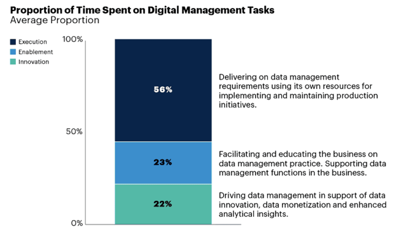
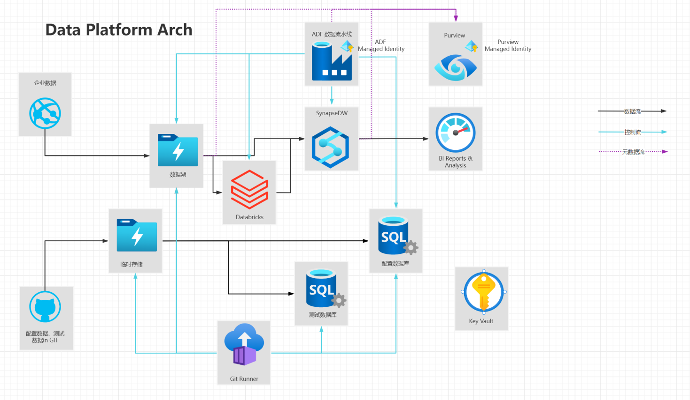

# DataOps-Starter Overview

| #    | Author                 | Revision              | Date     |
| ---- | ---------------------- | --------------------- | -------- |
| 1    | HarveyHu@microsoft.com | Initialization        | 2022-6-1 |
| 2    | yuesheng@microsoft.com | Review and add '背景' | 2022-6-2 |

 

## 背景

由于IOT设备的应用、云计算存储能力的增长、数据分析驱动决策的需要，企业中数据每年的增长速度非常快。对于大量数据的价值挖掘，89%的企业都会面临数据管理上的困难：数据本身的变化、需求的变化，新尝试的引入，可能需要非常长时间才能真正产生见解。从数据团队角度来说，会面临很多计划外的工作，比如解决数据权限问题、数据错误溯源等，导致效率很低，也对数据缺乏信任，创新的时间也就更短了（*March 2020 Gartner Survey, Data Management Struggles to Balance Innovation and Control*）

数据的动态性和大体量、当前技术的多样性和敏捷需求的迫切性都让数据运维化（DataOps）成为企业重要的能力。DataOps的价值可以总结为四大点：敏捷性、可靠性、稳健性和创新性。通过采取正确的DataOps实践，可以帮助企业通过合理的团队合作，更快地使用数据创造价值。

## 目标

通过一系列的动手实验， 帮助掌握在项目中实施DataOps的路径， 相关产品和技术手段，涵盖持续集成CI、持续部署CD、持续质量DQ、持续安全CS、持续治理CG、持续运维CO和持续改进与合作CC。 

但不包括： 

* 产品深度介绍， 例如GitHub, Synapse等
* 数据分析深度介绍
* 安全方案深度介绍

## 提前准备

相关工具：

* VS Code
* Visual Studio 2019+
* [Azure CLI](https://docs.microsoft.com/en-us/cli/azure/install-azure-cli)

环境准备：
1. 拥有AAD用户 (name : adminuser@yourdomain.com)，作为  subscription 的Owner
2. 打开Azure CLI，使用 `az login` 登录账号；`az account set --subscription $subscriptionID` 选择订阅
3. 使用 `az group create -l eastasia -n $resourceGroupName` 创建一个ResourceGroup（需替换$resourceGroupName，如rg-dataops-starter)
4. 使用 `az ad sp create-for-rbac --name $servicePrincipalName --role contributor --scopes /subscriptions/$subscriptionID/resourceGroups/$resourceGroupName --sdk-auth` 创建SPN并给指定资源组设RBAC为contributor（需替换 $servicePrincipalName，如github-cicd-spn）
5. 将SPN的返回保存为Github的secret: AZURE_CREDENTIALS
    ~~~cmd
    # 将如下输出保存到GitHub Repo的secrets中作为 secrets.AZURE_CREDENTIALS
    /*
    {
        "clientId": "<GUID>",
        "clientSecret": "<GUID>",
        "subscriptionId": "<GUID>",
        "tenantId": "<GUID>",
        (...)
      }
    */
    ~~~
6. 为方便后续操作，记录如下信息：

      | 信息：             | 示例：                               | 说明：                                                       |
      | ------------------ | ------------------------------------ | ------------------------------------------------------------ |
      | **TenantID**       | efa728a8-\*\*\*\*-\*\*\*\*-\*\*\*\*\-d8ce0bdc90da | 在**AAD Overview**页面可用看到                               |
      | **SubscriptionID** | f79d0fce-\*\*\*\*-\*\*\*\*-\*\*\*\*\-18a27eaa8054 | 从任意资源的url中可用看到                                    |
      | **SPN ObjectID**   | 7da72d5b-\*\*\*\*-\*\*\*\*-\*\*\*\*\-277ff74d5830 | 在**AAD Enterprise Applications** 下可用找到SPN的objectID。 (注意不是ApplicationID) |
      | **AdminID**        | 679e0424-\*\*\*\*-\*\*\*\*-\*\*\*\*\-a1a94edc55a0 | 在AAD User Profile 页面可用看到（ Object ID)                 |
      | **ResourceGroup**  | rg-dataops-starter                   | 实验过程中的所有资源都放在这个ResourceGroup 中               |

参考：

[Quickstart - Use Azure Key Vault secrets in GitHub Actions workflows | Microsoft Docs](https://docs.microsoft.com/en-us/azure/developer/github/github-key-vault#define-a-service-principal)

 

## 整体架构

| #    | 服务组件                       | 说明                                                     |      |
| ---- | ------------------------------ | -------------------------------------------------------- | ---- |
| 1    | GIT Hub Service                | 源码管理；CICD Workflow管理                              |      |
| 2    | GIT Runner                     | 执行CICD Workflow管理                                    |      |
| 3    | Azure Key Vault                | 保存机密信息Secrets                                      |      |
| 4    | Azure Data Lake Service(Gen 2) | 数据湖，保存文件格式的数据（业务）                       |      |
| 5    | Azure Storage Account          | 数据存储Blob, 保存文件格式的数据（测试、配置）           |      |
| 6    | Azure SQL Database             | 数据库，可作为1）DataMart, 2) 测试配置库 3）流水线配置库 |      |
| 7    | Azure Data Factory             | 组装和运行数据流水线                                     |      |
| 8    | Azure Synapse Analytics        | 数据仓库                                                 |      |
| 9    | Azure Databricks               | 数据湖仓一体                                             |      |
| 10   | Azure Purview                  | 数据治理                                                 |      |

 

## 步骤：

### == Level 100 ==

#### [实验1-1 - [CICD] 了解Github Workflow and Action](11lab.md) 

* 实现在GitHub Action 中输出Hello world
* 了解如何从Github Action Marketplace中查询
* 了解如何使用VS Code 编写workflow

#### [实验1-2 - [CICD] 了解Bicep, 实现Infrastructure as Code (IaC)](12lab.md)

* 实现使用Bicep创建一个KeyVault 和存储账号StorageAccount，并在KeyVault中保存访问Key
* 了解如何使用VS Code编写Bicep
* 了解Bicep官方文档
* 了解如何从JSON ARM中反向获取Bicep

#### [实验1-3 - [CICD] 了解测试数据发布到存储Blob和AzureSQL](13lab.md)

* 实现将数据文件csv提交到git
* 通过CI->artifacts->CD的过程将数据发布到blob
* 创建数据库资源，并在KeyVault中保存连接串
* 实现将建表语句和存储过程
* 通过CI->artifacts->CD的过程， 发布数据库
* 通过CD的过程， 将blob的数据发布到数据库

#### [实验1-4 - [CICD] 了解ADF数据流水线](14lab.md)

* 创建2个环境ADF资源，第一个配置Git repo; 配置ADF访问存储账号和数据的权限
* 创建ADF数据流水线, 实现将Blob数据复制到数据库
* 通过publish->CI->artifacts->CD的过程， 将ADF发布到下一环境

#### [实验1-5 - [CICD] 了解Databricks](15lab.md)

* 创建2个环境Databricks资源， 第一个配置Git repo
* 第二个配置Databricks token
* 通过CI->artifacts->CD的过程， 将Notebooks发布到下一环境

#### [实验1-6 - [CICD] 了解Synapse](16lab.md)

* 创建Synapse资源， 并在KeyVault中保存连接串和ADLS key
* 通过CI->artifacts->CD的过程， 发布数据仓库

#### [实验1-7 - [CICD] 清理资源](17lab.md)

* 通过AZ CLI Deployment 清理资源
* 了解增量模式和完整模式

### == Level 200 ==

#### [实验2-1 - [CICD] 了解GIT FLow 和 GITHub Flow 分支协作模式](21lab.md) 

* 了解Git flow和Github flow
* 了解Pull request 和分支策略(policy)
* 了解代码合并和解决冲突

#### [实验2-2 - [CICD] 深入了解GitHub的Workflow](22lab.md)

* 了解常用的触发机制
* 了解自定义Action
* 了解组合Workflow
* 了解环境变量和secrets
* 了解“守门员” （Approver）

#### [实验2-3 - [CICD] Bicep进阶](23lab.md)

* 了解模块引用机制
* 了解依赖和引用已有资源
* 了解循环和条件判断

#### [实验2-4 - [CICD] ADF 进阶](24lab.md) 	

* 参数化LinkService, DataSet, Pipleline
* FlagFeature Pipeline
* Metadata driven
* Copy活动的并行优化
* Pipeline组合调用

#### [实验2-5 - [CQ] 持续质量（一）SoTa测试框架应用](25lab.md)

*  部署ADF + Synapse + DB， 包括schema
*  上传测试用例
*  执行测试用例
*  查看测试结果

#### [实验2-6 - [CQ] 持续质量（二）开源框架或工具及流程](26lab.md)

* 了解Unit Test 框架之一 （pytest, nunit, vstest)
* 了解GreatExpection
* 了解[PR-CI] + [QA-CI] + [Fast-CI]

数据平台拓展内容：
#### [实验2-7 - Synapse进阶 ](27lab.md) 

* 了解单库拆分
* 了解Synapse的Polybase (External Table， Copy into)
* 了解Distribution和Index
* 了解SKEW检查
* 了解性能查询手段

#### [实验2-8 - Databricks 进阶](28lab.md)

* 发布Libs
* ...

#### [实验2-9 - 混合云部署数据平台](29lab.md)

* 了解混合云部署架构
* Github Enterprise
* Infra Securty
* .....

### == Level 300 ==

#### [实验3-1 - [CO] 持续监控和反馈](31lab.md)

* 了解ELK监控体系
* 了解Azure Monitor体系

#### [实验3-2 - [CG] Synapse的数据血缘分析](32lab.md)

* 了解DacFx 和 antlr， 了解抽象语法树（AST)
* 了解图数据库，了解Neo4j
* 了解血缘结果展示

#### [实验3-3 - [CG] 数据治理进阶](33lab.md)

* 部署Purview
* 了解数据资产， 管理数据资产
* 上传数据血缘关系
* 了解数据分类 + 自定义规则
* 了解数据洞察

#### [实验3-4 - [CQ] 数据反哺流水线](34lab.md)

* 了解数据脱敏
* 了解数据反哺流水线过程

MLOps等拓展内容：
#### [实验3-5 - ML数据及版本管理](35lab.md)

* 了解Databricks的ML flow
* Streaming Flow
* ...
