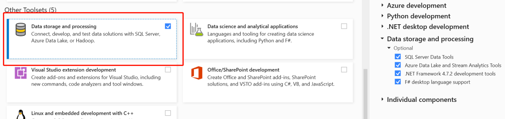
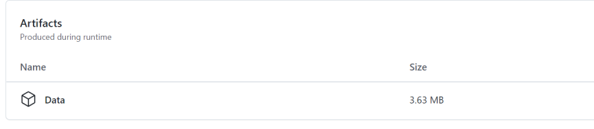
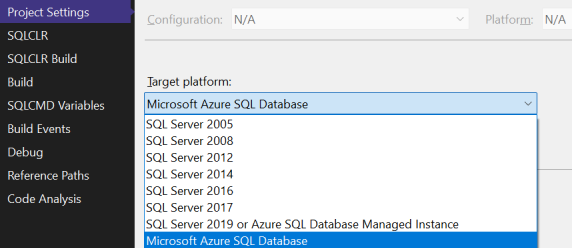

# 实验1-3 - 了解测试数据发布到Blob存储和Azure SQL

| #    | Author                 | Revision       | Date     |
| ---- | ---------------------- | -------------- | -------- |
| 1    | HarveyHu@microsoft.com | Initialization | 2022-6-2 |
| 2    | yuesheng@microsoft.com |     Review     | 2022-6-6 |

## 实验概述

- 实现将数据文件csv提交到git
- 通过CI->artifacts->CD的过程将数据发布到blob
- 创建数据库资源，并在KeyVault中保存连接串
- 实现将建表语句和存储过程
- 通过CI->artifacts->CD的过程， 发布数据库
- 通过CD的过程， 将blob的数据发布到数据库

## 前提条件

- 完成 Overview中的准备
- 安装 VS Code & 插件 Bicep 
- 安装 SSMS (SQL Server Management Studio 2019+)
- 安装 Visual Studio 2019 + & SSDT 组件
    

## 实验一

> 目标： 
>
> ​          将数据文件从git中同步到Blob;
>
> ​          并且在Blob中保存不同版本的数据。

1. 使用 **VS Code** 打开根目录"C:\Code\DataOpsStarter\ ; 

2. 新建目录 **13lab\00Data\01csv**， 将以下csv文件下载到本地目录中：

    > https://adlssalesdemo.blob.core.windows.net/lab/weights_heights.csv
    
    注意：因为GIT的限制，数据大小最好在100M以内。

3. 新建CI workflow。在\\.github\workflow目录下，新建文件lab13-CI-Blob.yml，将/13lab/00Data目录下的数据文件提交到Repo的Artifacts中。内容如下：

    ~~~yml
    name: lab13-CI-Blob

    on:
      workflow_dispatch:
      # push:
      #   branches:
      #     - "main"
    env:
      # Path to the solution file relative to the root of the project.
      SOLUTION_WORKSPACE: 13lab/00Data
      ARTIFACT_NAME: Data

    jobs:
      SQL-AdminOps-LoadData:
        runs-on: ubuntu-latest

        steps:
        - uses: actions/checkout@v3
        - name: browser
          run: tree .
        - name: Copy to Artifact Folder
          run: |
            mkdir -p ./artifacts/ci-run/${{github.RUN_NUMBER}}/ 
            cp -r ${{env.SOLUTION_WORKSPACE}}/ ./artifacts/ci-run/${{github.RUN_NUMBER}}/
        - name: Upload Data Artifact
          uses: actions/upload-artifact@v3
          with:
            name: ${{env.ARTIFACT_NAME}}
            path: ./artifacts/       

    ~~~

    

    值得一提的是，每次数据修改后重新提交， 通过 CI 上传到Blob的目录都加了 CI Run Number 编号， 起到**数据版本化**的作用。 

    | #    | Action                    | 说明                                                   |
    | ---- | -------------------------- | ------------------------------------------------------ |
    | 1    | actions/checkout@v3        | 签出代码，默认使用main分支                             |
    | 2    | bash: cp                   | 将内容拷贝到artifacts中， **并依据Run_number分子目录** |
    | 3    | actions/upload-artifact@v3 | 将./artifacts 内容上传到Repo的Artifacts                |

4. 新建CD workflow。在\\.github\workflow目录下，新建文件lab13-CD-Blob.yml, 内容如下：

    ~~~yml
    name: lab13-CD-Blob

    on:
      workflow_run:
        workflows: [lab13-CI-Blob]
        types:
          - completed

      workflow_dispatch:
      # push:
      #   branches:
      #     - "main"
    env:
      # Path to the solution file relative to the root of the project.
      ARTIFACT_NAME: Data
      STORAGE_ACCOUNT: storagehh101dev   # storage account name
      SRC_DATA: src-data   # same as blob container
      KEY_VAULT: kv-hh101-dev  # key vault name

    permissions:
      contents: read

    jobs:
      Deploy-SQLDB:
        runs-on: ubuntu-latest

        steps:
    #### Download artifact from CI
        - name: Download artifact from CI
          uses: aochmann/actions-download-artifact@1.0.4
        # - uses: actions/download-artifact@v3
          with:
            repo: HarveyHuBJ/DataOpsStarter
            github_token: ${{ secrets.GITHUB_TOKEN }}
            name: ${{ env.ARTIFACT_NAME }}
            path: ${{ env.SRC_DATA }}
            
    #### Display structure of downloaded files
        - name: Display structure of downloaded files
          run: tree .
          working-directory: ${{ env.SRC_DATA }}

    #### az login to access key vault 
        - name: az login with github_dataops_spn
          uses: azure/login@v1                            # github_dataops_spn
          with:
            creds: ${{ secrets.AZURE_CREDENTIALS }}
        
    #### Retrieve storage key
        - uses: Azure/get-keyvault-secrets@v1
          id: getSecretAction # ID for secrets that you will reference
          name: retrieve storage key
          with:
            keyvault: ${{env.KEY_VAULT}} # name of key vault in Azure portal
            secrets: 'secret-storage-key'  # comma separated list of secret keys to fetch from key vault 

    #### upload multi-files to blob
        - name: Azure CLI script - az copy data
          uses: azure/CLI@v1
          with:
            azcliversion: 2.30.0
            inlineScript: |
              az storage blob upload-batch -s ${{ env.SRC_DATA }} -d ${{ env.SRC_DATA }} --account-name  ${{ env.STORAGE_ACCOUNT }} --account-key ${{steps.getSecretAction.outputs.secret-storage-key}}       
    ~~~

    上述 CD 的过程， 是将上一步 CI 生成的 Artifacts 文件，复制到 Azure 存储账户的 Blob 中。 其中需要从 KeyVault 中获取访问Azure 存储账户的密钥。

    | #    | Action                                  | 说明                                        |
    | ---- | ---------------------------------------- | ------------------------------------------- |
    | 1    | aochmann/actions-download-artifact@1.0.4 | 将上一步CI上传的Artifacts 下载              |
    | 2    | bash: tree                               | 查看目录内容                                |
    | 3    | azure/login@v1                           | 登录azure， 使用预置的SPN                   |
    | 4    | Azure/get-keyvault-secrets@v1            | 获取key vault中指定的secrets, 后面会用到    |
    | 5    | azure/CLI@v1                             | 运行AZ CLI的命令， 将文件上传到Azure Blob中 |

5. 运行 CI 。由于 CD 中配置了如下所示的workflow_run，CI 完成后会自动触发 CD 。

    ~~~yml
      workflow_run:
        workflows: [lab13-CI-Blob]
        types:
          - completed
    ~~~

 

6. 观察结果。CI 完成后， 会在 workflow 的 Summary 页面上显示 Artifacts; 可用自行下载到本地，解压缩后观察 Artifacts 的内容；数据文件应该保存在 CI-run/xx/ 的目录下。CD 完成后， 会在 Blob 中出现新加的数据文件。

    

## 实验二

> 目标：
>
> ​		创建Azure SQL Database 资源; 
>
>  ​         并将数据库的连接信息保存到KeyVault中

1. 使用 **VS Code** 打开根目录"C:\Code\DataOpsStarter\ 

2. 新建子目录 **13lab** ， 在 **13lab** 下新建空文本文件 **sql_database.bicep**； 并将如下内容拷贝到文件中：

    ~~~powershell
    param env string='dev'
    param location string =  resourceGroup().location
    param familyName string='hh101'									 // replace:

    param keyvaultName string = 'kv-${familyName}-${env}'
    param tenantId string='efa728a8-8af1-45bd-9e56-d8ce0bdc90da'	 // replace:
    param adminAccount string='adminuser@cpuhackthon.onmicrosoft.com'  // replace:
    param adminId string='679e0424-4461-4989-807a-a1a94edc55a0'   // replace:
    param exp_unix_time int = 1716776048 // 2024-5-17
    
    param collation string = 'SQL_Latin1_General_CP1_CI_AS'
    param sqlServerName string = 'dbsrv-${familyName}-${env}'
    param sqlDatabaseName string = 'db-${familyName}-${env}'
    param sqlDatabaseSku object = {
      name:'S0'
      tier:'Standard'
    }

    param tags object = {
      env: env
      owner: 'harveyhu@microsoft.com'			 // replace:
      project: 'dataops-starter-lab'
    }

    var db_admin_password = substring('Pwd0!${uniqueString(resourceGroup().id)}',0, 12)

    resource sqlServer_resource 'Microsoft.Sql/servers@2020-11-01-preview' = {
      name: sqlServerName
      location: location
      tags:tags
      properties: {
        administrators:  {
          administratorType: 'ActiveDirectory'
          login: adminAccount
          sid: adminId
          tenantId: tenantId
          azureADOnlyAuthentication: false
          principalType: 'User'
        }
        
        publicNetworkAccess:'Enabled'
        administratorLogin: 'db_admin'
        administratorLoginPassword: db_admin_password

      }
      
      resource sqlServerFirewallRules 'firewallRules@2020-11-01-preview' = {
        name: 'AllowAllWindowsAzureIps'
        properties: {
          startIpAddress: '1.1.1.1'
          endIpAddress: '255.255.255.0'
        }
      }
    }

    resource sqlDatabase_resource 'Microsoft.Sql/servers/databases@2020-11-01-preview' = {
      parent: sqlServer_resource
      name: sqlDatabaseName
      tags:tags
      location: location
      sku: {
        name: sqlDatabaseSku.name
        tier: sqlDatabaseSku.tier
      }
      properties:{
        collation:collation
        maxSizeBytes:53687091200
        zoneRedundant:false
      }
      resource synapse_workspace_tde  'transparentDataEncryption' = {
        name: 'current'
        properties:{
        state: 'Enabled'
      }
      }
    }

    resource keyvault_resource 'Microsoft.KeyVault/vaults@2021-10-01' existing={
      name: keyvaultName
    }

    resource keyVaultSecret 'Microsoft.KeyVault/vaults/secrets@2019-09-01' = {
      parent: keyvault_resource
      name: 'secret-dbadmin-pwd'
      properties: {
        value:  db_admin_password
        attributes:{
          enabled: true
          exp: exp_unix_time
        }
      }
    }

    ~~~

    注意， 需要将相关参数替换成自己的值。

    上述文件将创建一个 Azure SQL Server 资源， 一个 SQL Database 资源（含防火墙设置)， 并将数据库的登录账号 db_admin 的密码保存到了现有的 KeyVault 中。

    数据库可用同时支持 SQL 认证方式（sqladmin) 和 AAD认证方式(adminuser@yourAAD.com)。

    | #    | 资源                   | 说明                                                         |
    | ---- | ---------------------- | ------------------------------------------------------------ |
    | 1    | sqlServer_resource     | SQL Server 实例                                              |
    | 2    | sqlServerFirewallRules | SQL Server 防火墙， 本例按全IP通行设置                       |
    | 3    | sqlDatabase_resource   | SQL Database实例， 依赖于sqlServer_resource                  |
    | 4    | keyVaultSecret         | 将db_admin用户的密码保存到KeyVault的Secrets中： secret-dbadmin-pwd |

3.  使用Azure CLI登录。如果已经设置过了，此步骤可忽略

    ~~~cmd
    az bicep install && az bicep upgrade        # 确保安装了bicep 模块

    az login					# 登录， 使用adminuser 账号

    az account set --subscription {your subscription ID}  # 选择订阅

    az configure --defaults group=rg-dataops-starter  # 设置默认资源组； 如果不设默认， 则后面每个命令需要单独指定一次。
    ~~~

4. 运行Bicep

    ~~~cmd
    # 进入工作区目录
    cd C:\Code\DataOpsStarter\13lab
    # 部署Bicep 文件
    az deployment group create --template-file sql_database.bicep
    ~~~

    你也可用在后面添加指定参数来覆盖文件中默认的参数

    ~~~cmd
    --parameters env=sit familyName=abc100 ......
    ~~~

5. 观察结果。通过上面的步骤， 首先我们可以看到在 Azure Portal中， 资源组 rg-dataops-starter 下新增加了两个资源：

   - SQL Server: dbsvr-hh101-dev
   - SQL Database: db-hh101-dev

   并且每个资源都有3个tags：

   * env: 'dev'
   * owner: '******@domain.com'	
   * project: 'dataops-starter-lab'

   打开KeyVault 资源， 可用看到新增加的Secrets

   * secret-dbadmin-pwd

## 实验三

> 目标：
>
> ​         将数据从Blob 同步到Azure SQL Database对应的Table表中

1. 使用 **VS Code** 打开根目录"C:\Code\DataOpsStarterer\ ; 

2. 使用Visual Studio 2019或更高版本，在目录 **13lab\DB**\ 新建数据库工程(DB.sqlproj)，注意选择项目的属性是

    

    然后将如下内容解压后， 添加到工程中。

    > https://adlssalesdemo.blob.core.windows.net/lab/DBProject.zip

    新建数据库工程的过程， 请参考：[Create a New Database Project - SQL Server Data Tools (SSDT) | Microsoft Docs](https://docs.microsoft.com/en-us/sql/ssdt/how-to-create-a-new-database-project?view=sql-server-ver16)

3. 编译数据库工程，确保没有报错。在Visual Studio中， 按F6开始编译。编译完成后， 可以在./bin/debug/目录下， 找到一个*.DACPAC文件， 这就是数据库工程编译的结果。 
    
    关于DACPAC文件的更多介绍， 可以参考：[Data-tier Applications - SQL Server | Microsoft Docs](https://docs.microsoft.com/en-us/sql/relational-databases/data-tier-applications/data-tier-applications?view=sql-server-ver16)

4. 本地发布数据库工程。在 Visual Studio中右键项目工程名称， 在弹出菜单中点击**发布**，根据向导提示， 将数据库发布到步骤二创建的Azure数据库中（认证过程使用AAD 认证即可）。

5. 观察结果。发布成功后， 使用 SSMS（AAD 用户登录认证）， 连接到数据库上， 观察是否存在数据库工程中创建的表和存储过程。

   - 表： [Lab].[weights_heights], [Lab].[telecom_churn]
   - 存储过程： [Lab].uspReloadLabData , [Lab].uspCreateScopedCredential, [Lab].uspCreateExternalDataSource

6. 可以自行尝试修改表， 修改字段以及其他数据库更新操作，发布后再次观察效果

    例如：

    - 修改表名称 ， 重构表名称
    - 修改表字段， 重构表字段
    - 修改表字段类型
    - 等等

7. 清空数据库

    ~~~sql
    -- 清空表
    drop table  [Lab].[weights_heights]
    drop table  [Lab].[telecom_churn]

    -- 清空存储过程
    drop proc  [Lab].uspReloadLabData
    drop proc  [Lab].uspCreateScopedCredential
    drop proc  [Lab].uspCreateExternalDataSource
    ~~~

## 实验四

> 目标:
>
> ​       使用CICD 的方式， 部署数据库

1. 使用 **VS Code** 打开根目录"C:\Code\DataOpsStarterer\ ; 

2. 在\\.github\workflow目录下，新建文件lab13-CI-Database.yml, 内容如下：

    ~~~yaml
    name: lab13-CI-Database

    on:
      # push:
      #   branches:
      #     - "main"

      workflow_dispatch:
      workflow_call:
    env:
      # Path to the solution file relative to the root of the project.
      SOLUTION_WORKSPACE: 13Lab\DB\
      SOLUTION_FILE_PATH: Db.sqlproj
      ARTIFACT_NAME: db_artifact

      # Configuration type to build.
      # You can convert this to a build matrix if you need coverage of multiple configuration types.
      # https://docs.github.com/actions/learn-github-actions/managing-complex-workflows#using-a-build-matrix
      BUILD_CONFIGURATION: Release

    permissions:
      contents: read

    jobs:
      build-SQLDB-By-MSBuild:
        runs-on: windows-latest

        steps:
        - uses: actions/checkout@v3

        - name: Add MSBuild to PATH
          uses: microsoft/setup-msbuild@v1.0.2

        - name: Restore NuGet packages
          working-directory: ${{env.SOLUTION_WORKSPACE}}
          run: nuget restore ${{env.SOLUTION_FILE_PATH}}

        - name: Build
          working-directory: ${{env.SOLUTION_WORKSPACE}}
          # Add additional options to the MSBuild command line here (like platform or verbosity level).
          # See https://docs.microsoft.com/visualstudio/msbuild/msbuild-command-line-reference
          run: msbuild /m /p:Configuration=${{env.BUILD_CONFIGURATION}} ${{env.SOLUTION_FILE_PATH}}

        - name: Upload DACPAC Artifact
          uses: actions/upload-artifact@v3
          with:
            name: ${{env.ARTIFACT_NAME}}
            path: ${{env.SOLUTION_WORKSPACE}}/bin/${{env.BUILD_CONFIGURATION}}/*.dacpac

    ~~~

    上述CI的过程， 是将 /13lab/Db 目录下的数据库工程使用 **MSBUILD** 编译后， 将 *.dacpac 上传到 Repo 的 Artifact中。

    | #    | Action                        | 说明                                 |
    | ---- | ------------------------------ | ------------------------------------ |
    | 1    | actions/checkout@v3            | 签出main分支（默认）代码             |
    | 2    | microsoft/setup-msbuild@v1.0.2 | 安装msbuild工具                      |
    | 3    | bash run: nuget restore        | 恢复项目的nuget依赖项                |
    | 4    | actions/upload-artifact@v3     | 将build的结构上传的Repo的artifacts中 |

3. 在\\.github\workflow目录下，新建文件lab13-CD-Database.yml, 内容如下：

    ~~~yaml
    name: lab13-CD-Database

    on:
      workflow_run:
        workflows: [lab13-CI-Database]
        types:
          - completed

      workflow_call:
      workflow_dispatch:
      # push:
      #   branches:
      #     - "main"
    env:
      # Path to the solution file relative to the root of the project.
      SOLUTION_WORKSPACE: 13lab\db\
      SOLUTION_FILE_PATH: Db.sqlproj
      ARTIFACT_NAME: db_artifact
      KEY_VAULT: kv-hh101-dev
      DB_SERVER: dbsrv-hh101-dev.database.windows.net
      DB_NAME: db-hh101-dev
      DB_USER_LOGIN: db_admin

      # Configuration type to build.
      # You can convert this to a build matrix if you need coverage of multiple configuration types.
      # https://docs.github.com/actions/learn-github-actions/managing-complex-workflows#using-a-build-matrix
      BUILD_CONFIGURATION: Release

    permissions:
      contents: read

    jobs:
      Deploy-SQLDB:
        runs-on: ubuntu-latest

        steps:
    #### Download Artifact
        - name: Download dacpac from CI
          uses: aochmann/actions-download-artifact@1.0.4
        # - uses: actions/download-artifact@v3
          with:
            repo: HarveyHuBJ/MsDataOpsStarterer
            github_token: ${{ secrets.GITHUB_TOKEN }}
            name: ${{ env.ARTIFACT_NAME }}
            path: .
            
        - name: Display structure of downloaded files
          run: dir
          working-directory: .
    #### Azure login 
        - uses: azure/login@v1                            # Azure login required to add a temporary firewall rule
          with:
            creds: ${{ secrets.AZURE_CREDENTIALS }}

    #### retrieve dbadmin password
        - uses: Azure/get-keyvault-secrets@v1
          id: getSecretAction # ID for secrets that you will reference
          name: retrieve dbadmin password
          with:
            keyvault: ${{env.KEY_VAULT}} # name of key vault in Azure portal
            secrets: 'secret-dbadmin-pwd'  # comma separated list of secret keys to fetch from key vault 
        
    #### Azure SQL Deploy with Dacpac
        - name: Azure SQL Deploy
          uses: Azure/sql-action@v1.3
          with:
            # Name of the Azure SQL Server name, like Fabrikam.database.windows.net.
            # server-name: ${{env.DB_SERVER}} # optional
            # The connection string, including authentication information, for the Azure SQL Server database.
            connection-string: Server=tcp:${{env.DB_SERVER}},1433;Initial Catalog=${{env.DB_NAME}};Persist Security Info=False;User ID=${{env.DB_USER_LOGIN}};Password=${{steps.getSecretAction.outputs.secret-dbadmin-pwd}};MultipleActiveResultSets=False;Encrypt=True;TrustServerCertificate=False;
            # Path to DACPAC file to deploy
            dacpac-package: 01AdvDb.dacpac # optional
            # In case DACPAC option is selected, additional SqlPackage arguments that will be applied. When SQL query option is selected, additional sqlcmd arguments will be applied.
            arguments: "/dsp:deploy_script.sql /p:IgnoreColumnOrder=true" # optional

    #### Upload deploy_script Artifact
        - name: Upload deploy_script Artifact
          uses: actions/upload-artifact@v3
          with:
            name: deploy_script
            path: deploy_script*.*

    ~~~

    上述CD的过程， 是将上一步 CI 生成的 Artifacts 文件中的 Dacpac 文件部署到指定的 SQL server中， 并且将部署过程的增量脚本上传到 Repo 的 Artifacts.

 

    | #    | Action                                  | 说明                                                   |
    | ---- | ---------------------------------------- | ------------------------------------------------------ |
    | 1    | aochmann/actions-download-artifact@1.0.4 | 下载指定的Repo artifacts                               |
    | 2    | azure/login@v1                           | 使用SPN登录Azure                                       |
    | 3    | Azure/get-keyvault-secrets@v1            | 获取KeyVault中指定的secrets                            |
    | 4    | Azure/sql-action@v1.3                    | 将Dacpac发布到指定的数据库， 并输出增量的deploy_script |
    | 5    | actions/upload-artifact@v3               | 将增量deploy_script 上传的Repo的artifacts              |

4. 运行CI。如果CD中配置了workflow_run， 如下所示， 则会自动在CI 完成后自动触发 CD

    ~~~yaml
      workflow_run:
        workflows: [lab13-CI-Blob]
        types:
          - completed
    ~~~

 

5. 观察结果。CI 完成后， 会在 workflow 的 Summary 页面上显示 Artifacts; 可用自行下载到本地，解压缩后观察 Artifacts 的内容；CD 完成后，数据库中会数据库工程中的表、存储过程等对象。

## 实验五

> 目标: 
>
> ​        将Blob的数据加载到数据库中，作为初始化数据

1. 使用**VS Code**打开根目录"C:\Code\DataOpsStarterer\ ; 

2. 在\\.github\workflow目录下，新建文件lab13-CD-Database-x-BulkInsert.yml, 内容如下：

    ~~~yaml
    name: CD-03-x-BlobAsSQLExternal

    on:
      workflow_dispatch: 
        inputs:
            ci_run_number:
              description: 'ci run number'     
              required: true
              default: '19'
            file_codes:
              description: 'input file#(eg #1,#2); input "all" for running all loading'     
              required: true
              default: 'all'

    env:
      # Path to the solution file relative to the root of the project.
      FAMILY_NAME: hh101 
      ENV_NAME: dev 

    permissions:
      contents: read

    jobs:
      Deploy-SQLDB:
        runs-on: ubuntu-latest
        steps:
        #### set environment variables
        - name: set environment variables
          uses: allenevans/set-env@v2.0.0
          with:
            STORAGE_ACCOUNT: storage${{env.FAMILY_NAME}}${{env.ENV_NAME}} 
            SRC_DATA: src-data   # same as blob container

            KEY_VAULT: kv-${{env.FAMILY_NAME}}-${{env.ENV_NAME}} 

            DB_SERVER: dbsrv-${{env.FAMILY_NAME}}-dev.database.windows.net
            DB_NAME: db-${{env.FAMILY_NAME}}-${{env.ENV_NAME}} 
            DB_USER_LOGIN: db_admin

        #### checkout repo.
        - uses: actions/checkout@v3
          name: checkout repo.
      
        #### az login to access key vault 
        - name: az login with github_dataops_spn
          uses: azure/login@v1                            # github_dataops_spn
          with:
            creds: ${{ secrets.AZURE_CREDENTIALS }}
        
        #### retrieve secrets, including secret-storage-sas,secret-dmk,secret-dbadmin-pwd
        - uses: Azure/get-keyvault-secrets@v1
          id: getSecretAction # ID for secrets that you will reference
          name: retrieve secrets
          with:
            keyvault: ${{env.KEY_VAULT}} # name of key vault in Azure portal
            secrets: 'secret-storage-sas,secret-dmk,secret-dbadmin-pwd'  # comma separated list of secret keys to fetch from key vault 
    

        #### run sql script - call init_external_data_source
        - name: Azure SQL Deploy - call init_external_data_source
          uses: Azure/sql-action@v1.3
          with:
            # The connection string, including authentication information, for the Azure SQL Server database.
            connection-string: Server=tcp:${{env.DB_SERVER}},1433;Initial Catalog=${{env.DB_NAME}};Persist Security Info=False;User ID=${{env.DB_USER_LOGIN}};Password=${{steps.getSecretAction.outputs.secret-dbadmin-pwd}};MultipleActiveResultSets=False;Encrypt=True;TrustServerCertificate=False;
            sql-file: './13lab/AdminScripts/init_external_data_source.sql'  
            # additional sqlcmd arguments will be applied.
            arguments: '-v name="${{env.FAMILY_NAME}}" dmk_password="${{steps.getSecretAction.outputs.secret-dmk}}" sas="${{steps.getSecretAction.outputs.secret-storage-sas}}" blob_location="https://${{env.STORAGE_ACCOUNT}}.blob.core.windows.net/${{env.SRC_DATA}}"'  
            # arguments: '-v cols=name,object_id'   # for demo.sql

    
        #### run sql script - call init_external_data_source
        - name: Azure SQL Deploy - call bulk_inserts
          uses: Azure/sql-action@v1.3
          with:
            # The connection string, including authentication information, for the Azure SQL Server database.
            connection-string: Server=tcp:${{env.DB_SERVER}},1433;Initial Catalog=${{env.DB_NAME}};Persist Security Info=False;User ID=${{env.DB_USER_LOGIN}};Password=${{steps.getSecretAction.outputs.secret-dbadmin-pwd}};MultipleActiveResultSets=False;Encrypt=True;TrustServerCertificate=False;
            sql-file: './13lab/AdminScripts/bulk_inserts.sql'  
            # additional sqlcmd arguments will be applied.
            arguments: '-v name="${{env.FAMILY_NAME}}" files="${{github.event.inputs.file_codes }}" root="ci-run/${{github.event.inputs.ci_run_number}}/00Data/01csv" '  
            

    ~~~

    | #    | Action                   |                                                           说明   |
    | ---- | ------------------------- | ------------------------------------------------------------ |
    | 1    | allenevans/set-env@v2.0.0 | 设置环境变量， 使用已有的一些环境变量值                      |
    | 2    | actions/checkout@v3       | 签出main分支（默认）的代码                                   |
    | 3    | azure/login@v1            | 使用SPN登录Azure                                             |
    | 4    | Azure/sql-action@v1.3     | 将指定的sql script文件在指定的SQL Database上运行， 并且使用了参数化 |
    | 5    | Azure/sql-action@v1.3     | 同上， 运行了另一个sql script文件。                          |

    另外使用了2个sql 文件作为数据导入的实现， 均保存在**13lab\AdminScripts**目录下：

    ~~~sql
    -- File: init_external_data_source.sql

    IF not exists (select top 1 1 from sys.external_data_sources a where name ='$(name)BlobStorage')
    BEGIN
        -- step1, MASTER KEY
        IF not exists (select top 1 1 from sys.symmetric_keys)
            CREATE MASTER KEY ENCRYPTION BY PASSWORD = '$(dmk_password)';

        -- step2, DATABASE SCOPED CREDENTIAL
        -- issue, it seems SAS cann't input as a parameter for SAS has some special characters, like '=' , '&'
        IF not exists (select top 1 1 from sys.database_scoped_credentials where name ='$(name)Credential')
            CREATE DATABASE SCOPED CREDENTIAL $(name)Credential
            WITH IDENTITY = 'SHARED ACCESS SIGNATURE',
            SECRET = '$(sas)';

        -- step3, EXTERNAL DATA SOURCE
        CREATE EXTERNAL DATA SOURCE $(name)BlobStorage
        WITH ( TYPE = BLOB_STORAGE,
                LOCATION = '$(blob_location)'
                , CREDENTIAL= $(name)Credential --> CREDENTIAL is not required if a blob is configured for public (anonymous) access!
        );

    END
    -- drop External DATA SOURCE MyAzureBlobStorage
    -- drop DATABASE SCOPED CREDENTIAL MyAzureBlobStorageCredential
    -- drop MASTER KEY
    ~~~

    Azure 数据库可以连接到Azure Blob作为外接数据源。 上述脚本就是将Blob作为外接数据源关联上来， 需要提供Blob连接的SAS信息。可以重复执行。 

    ~~~sql
    -- File: init_external_data_source.sql

    -- category mappings
    -- #1 , telecom_churn.csv
    -- #2 , weights_heights.csv

    SET NOCOUNT ON;

    IF CHARINDEX('#1', '$(files)')>0 or '$(files)'='all'
    BEGIN
        PRINT 'Reloading [Lab].[telecom_churn] data.'
        TRUNCATE TABLE Lab.telecom_churn;
        BULK INSERT Lab.telecom_churn FROM '$(root)/telecom_churn.csv' WITH ( DATA_SOURCE = '$(name)BlobStorage' , FORMAT = 'CSV',		FIELDTERMINATOR =',' ,	 firstrow=2 ,	ROWTERMINATOR ='0x0a' ); 
    END
    GO

      
    IF CHARINDEX('#2', '$(files)')>0 or '$(files)'='all'
    BEGIN
        PRINT 'Reloading [Lab].[weights_heights] data.'
        TRUNCATE TABLE Lab.weights_heights;
        BULK INSERT Lab.weights_heights FROM '$(root)/weights_heights.csv' WITH ( DATA_SOURCE = '$(name)BlobStorage' , FORMAT = 'CSV',		FIELDTERMINATOR =',' ,	 firstrow=2 ,	ROWTERMINATOR ='0x0a'); 
    END

    PRINT 'Reloading completed.'

    ~~~

3. lab13-CD-Database-x-BulkInsert.yml 在手动触发的时候， 会提示输入参数：ci_run_number 和 file_codes。该workflow执行完成后， 数据库的对应表中， 应该已经存在从csv中导入的数据。

    | 参数：        | 示例： | 说明                                                         |
    | ------------- | ------ | ------------------------------------------------------------ |
    | ci_run_number | 21     | 因为Blob上保存了不同ci_run_number 的data, 所以需要提供该参数以明确数据文件路径 |
    | file_codes    | #1     | 为简化起见 ， 不同的文件分别做了编号映射，具体参考init_external_data_source.sql 在的注释 |

    

## 参考资料

[[1]. Data-tier Applications - SQL Server | Microsoft Docs](https://docs.microsoft.com/en-us/sql/relational-databases/data-tier-applications/data-tier-applications?view=sql-server-ver16)

[[2]. Access external data: SQL Server - PolyBase - SQL Server | Microsoft Docs](https://docs.microsoft.com/en-us/sql/relational-databases/polybase/polybase-configure-sql-server?view=sql-server-ver16)

[[3]. Create a New Database Project - SQL Server Data Tools (SSDT) | Microsoft Docs](https://docs.microsoft.com/en-us/sql/ssdt/how-to-create-a-new-database-project?view=sql-server-ver16)

[[4]. Data-tier Applications - SQL Server | Microsoft Docs](https://docs.microsoft.com/en-us/sql/relational-databases/data-tier-applications/data-tier-applications?view=sql-server-ver16)

