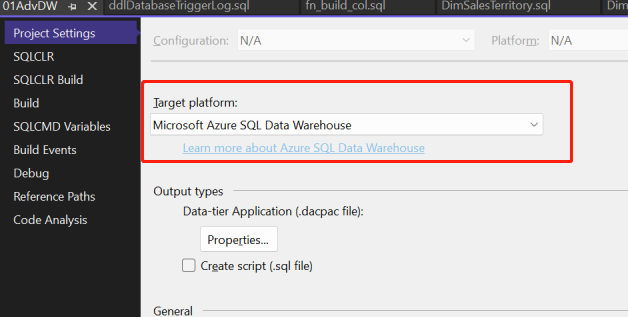
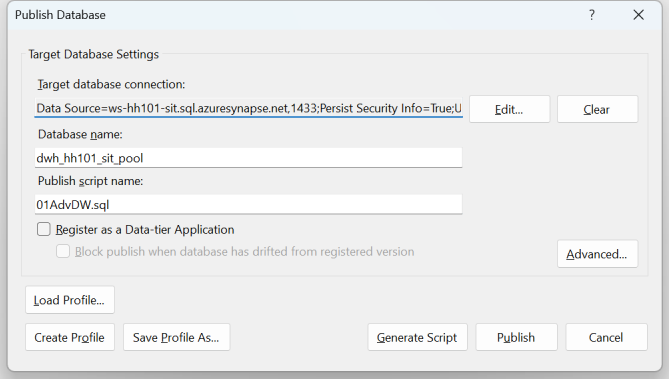

# 实验1-6 - 了解Synapse

| #    | Author                 | Revision       | Date     |
| ---- | ---------------------- | -------------- | -------- |
| 1    | HarveyHu@microsoft.com | Initialization | 2022-6-2 |
| 2    |                        |                |          |

[TOC]

## 1. 实验概述

- 了解Bicep 以及如何编写、运行

## 2. 前提条件

- Azure账号及订阅
- VS Code & 插件 Bicep 
- Visual Studio 2019+ & SSDT 组件
- AZ CLI
  - 下载及安装 [How to install the Azure CLI | Microsoft Docs](https://docs.microsoft.com/en-us/cli/azure/install-azure-cli)

## 3. 实验一

> 目标：
>
> ​         创建1个Azure Synapse资源 
>

### a.  进入根目录C:\Code\DataOpsStarter\

​	      使用**VS Code**打开根目录"C:\Code\DataOpsStarter\ ; 

### b. 准备创建Synapse资源的Bicep

​		 创建目录**\16lab\\** , 新建文件 **\16lab\synapse.bicep**

~~~json
param familyName string = 'hh101'                            // replace
param env string='dev'
param location string= resourceGroup().location
param workspaceName string = 'ws-${familyName}-${env}'

param adls_account_name string = 'storage${familyName}${env}adls'
param adls_file_system_name string = 'raw-data'

param storageKind string = 'StorageV2'

param sqlPoolName string = 'dwh_${familyName}_${env}_pool'
param collation string = 'SQL_Latin1_General_CP1_CI_AS'
param dw_sku string = 'DW200c'
param adminId string='679e0424-4461-4989-807a-a1a94edc55a0'  // replace

param keyvaultName string = 'kv-${familyName}-${env}'
param exp_unix_time int = 1716776048 // 2024-5-17

param tags object = {
  env: env
  owner: 'harveyhu@microsoft.com'             // replace
  project: 'dataops-starter-lab'
}

var dw_admin_password = substring('Pwd0!${uniqueString(resourceGroup().id)}',0, 12)
 
resource adls_account_resource 'Microsoft.Storage/storageAccounts@2021-01-01' =   {
  name: adls_account_name
  location: location
  tags:tags
  properties: {
    accessTier: 'Hot'
    supportsHttpsTrafficOnly: true
    isHnsEnabled: true
    minimumTlsVersion: 'TLS1_2'
  }
  sku: {
    name: 'Standard_LRS'
  }
  kind: storageKind 
  
}

resource adls_file_system_resource 'Microsoft.Storage/storageAccounts/blobServices/containers@2021-01-01' =  {
  name: '${adls_account_name}/default/${adls_file_system_name}'
  properties: {
    publicAccess: 'None'
  }
  dependsOn: [
    adls_account_resource
  ]
}

// var defaultDataLakeStorageAccountUrl2 = adls_account_resource.properties.primaryEndpoints.web
resource synapse_workspace_resource 'Microsoft.Synapse/workspaces@2021-06-01' = {
  name: workspaceName
  tags:tags  
  location: location
  identity: {
    type: 'SystemAssigned'
  }
  properties: {
    defaultDataLakeStorage: {
      accountUrl: adls_account_resource.properties.primaryEndpoints.dfs
      filesystem: adls_file_system_name
      resourceId: adls_file_system_resource.id
      createManagedPrivateEndpoint: false
    }
    
    managedVirtualNetwork: ''
    managedResourceGroupName: ''
    azureADOnlyAuthentication: false
    sqlAdministratorLogin: 'dw_admin'
    sqlAdministratorLoginPassword: dw_admin_password
    cspWorkspaceAdminProperties:{
       initialWorkspaceAdminObjectId: adminId
    }
    trustedServiceBypassEnabled:true
  }
}

resource firewall_allowAll 'Microsoft.Synapse/workspaces/firewallrules@2021-06-01' =   {
  parent: synapse_workspace_resource
  name: 'allowAll'
  properties: {
    startIpAddress: '0.0.0.0'
    endIpAddress: '255.255.255.255'
  }
}

// var sqlPool_name = '${workspaceName}/${sqlPoolName}'
resource sqlPool_resource 'Microsoft.Synapse/workspaces/sqlPools@2021-06-01' = {
  location: location
  name: sqlPoolName
  tags:tags
  parent: synapse_workspace_resource
  sku: {
    name: dw_sku
  }
  properties: {
    createMode: 'Default'
    collation: collation
    storageAccountType:  'LRS'
  }
  resource synapse_workspace_tde  'transparentDataEncryption' = {
    name: 'current'
    properties:{
      status: 'Enabled'
    }
  }
}

resource sqlpool_metadatasync 'Microsoft.Synapse/workspaces/sqlPools/metadataSync@2021-06-01' = {
  parent: sqlPool_resource
  name: 'config'
  properties: {
    enabled: false
  }
}

// save password in keyvault
resource keyvault_resource 'Microsoft.KeyVault/vaults@2021-10-01' existing={
  name: keyvaultName
}

// dedicate pool account password
resource keyVaultSecret 'Microsoft.KeyVault/vaults/secrets@2019-09-01' = {
  parent: keyvault_resource
  name: 'secret-dwadmin-pwd'
  properties: {
    value:  dw_admin_password
    attributes:{
      enabled: true
      exp: exp_unix_time
    }
  }
}

// ADLS storage key
resource keyVaultSecret2 'Microsoft.KeyVault/vaults/secrets@2019-09-01' = {
  parent: keyvault_resource
  name: 'secret-adls-key'
  properties: {
    value:  adls_account_resource.listKeys().keys[0].value
    attributes:{
      enabled: true
      exp: exp_unix_time
    }
  }
}

~~~

​        上面定义的资源包括

| #    | 资源定义                   | 说明                                                        |
| ---- | -------------------------- | ----------------------------------------------------------- |
| 1    | adls_account_resource      | ADLS 托管存储                                               |
| 2    | adls_file_system_resource  | ADLS 托管存储中的文件系统（根目录）                         |
| 3    | synapse_workspace_resource | Synapse的Workspace， 自带一个共享SQL pool                   |
| 4    | firewall_allowAll          | Synapse的防火墙设置， 此处全开                              |
| 5    | sqlPool_resource           | 一个Dedicate Pool， 作为数据仓库                            |
| 6    | keyVaultSecret             | dw_admin 账号的密码， 保存到KeyVault中： secret-dwadmin-pwd |
| 7    | keyVaultSecret2            | ADLS的存储账号的Key,  保存到KeyVault中：secret-adls         |

### c.  使用AZ-CLI登录

~~~cmd
az bicep install && az bicep upgrade        # 确保安装了bicep 模块

az login					# 登录。 使用AdminUser账号

az account set --subscription {your subscription ID}  # 选择订阅

az configure --defaults group=rg-dataops-starter  # 设置默认资源组； 如果不设默认， 则后面每个命令需要单独指定一次。
~~~

### d. 运行Bicep, 创建Synapse资源

~~~cmd
# 进入工作区目录
cd C:\Code\DataOpsStarter\16lab
# 部署Bicep 文件
az deployment group create --template-file synapse.bicep  
~~~

### 4. 实验二

> 目标：
>
> ​         本地创建SQL DW 数据库工程， 并上传到git repo

### a.  在目录C:\Code\DataOpsStarter\16Lab下新建数据库工程01AdvDW

​	      使用Visual Studio 新建数据库工程01AdvDW, 会自动创建子目录01AdvDW

### b. 给工程选择属性 "Microsoft Azure SQL Data Warehouse"

### c. 将下面内容加入到数据库工程中

下载后解压， 复制到数据库工程的根路径中

> https://adlssalesdemo.blob.core.windows.net/lab/DW-project-dbo.zip

观察Synapse DW和常规SQL Server的一些语法差异， 比如建表语句。 

### d. 编译和发布

使用在Visual Studio中， 按F6键编译数据库工程项目， 如果没有错误， 则会在bin\debug目录下生成一个*.dacpac文件。

右键点击项目文件， 选择发布， 可以将数据库工程发布到指定的Synapse dedicate pool 中。 

### e. 观察后清理

发布完成后， 可以使用SSMS连接到Synapse dedicate pool， 观察表、存储过程等是否与本地的一致。 

可以在本地对数据库对象，如表、字段等进行修改，重新发布， 观察改变的影响。 

然后， 对数据库进行清理， 删除所有的表、视图、存储过程等对象。 

### 5. 实验三

> 目标：
>
> ​         通过CICD的方式， 将git中的数据库工程发布到Synapse中

### a.  进入根目录C:\Code\DataOpsStarter\

​	      使用**VS Code**打开根目录"C:\Code\DataOpsStarter\ ; 

### b. 新建CI workflow

​		在\\.github\workflow目录下，新建文件lab16-CI-Synapse.yml, 内容如下：

~~~yml
name: lab16-CI-Synapse

on:
  # push:
  #   branches:
  #     - "main"

  workflow_dispatch:
  workflow_call:
env:
  # Path to the solution file relative to the root of the project.
  SOLUTION_WORKSPACE: 16lab\01AdvDW\
  SOLUTION_FILE_PATH: 01AdvDW.sqlproj
  ARTIFACT_NAME: AdvWorksDW

  # Configuration type to build.
  # You can convert this to a build matrix if you need coverage of multiple configuration types.
  # https://docs.github.com/actions/learn-github-actions/managing-complex-workflows#using-a-build-matrix
  BUILD_CONFIGURATION: Release

permissions:
  contents: read

jobs:
  build-SQLDB-By-MSBuild:
    runs-on: windows-latest

    steps:
    - uses: actions/checkout@v3

    - name: Add MSBuild to PATH
      uses: microsoft/setup-msbuild@v1.0.2

    - name: Restore NuGet packages
      working-directory: ${{env.SOLUTION_WORKSPACE}}
      run: nuget restore ${{env.SOLUTION_FILE_PATH}}

    - name: Build
      working-directory: ${{env.SOLUTION_WORKSPACE}}
      # Add additional options to the MSBuild command line here (like platform or verbosity level).
      # See https://docs.microsoft.com/visualstudio/msbuild/msbuild-command-line-reference
      run: msbuild /m /p:Configuration=${{env.BUILD_CONFIGURATION}} ${{env.SOLUTION_FILE_PATH}}

    - name: Upload DACPAC Artifact
      uses: actions/upload-artifact@v3
      with:
        name: ${{env.ARTIFACT_NAME}}
        path: ${{env.SOLUTION_WORKSPACE}}/bin/${{env.BUILD_CONFIGURATION}}/*.dacpac

~~~

​		上述CI的过程， 是将/16lab/01AdvDW目录下的数据库工程编译， 然后将编译的结果dacpac文件提交到Repo的Artifacts中。

| #    | Action                         | 说明                                 |
| ---- | ------------------------------ | ------------------------------------ |
| 1    | actions/checkout@v3            | 签出代码， 默认使用main分支          |
| 2    | microsoft/setup-msbuild@v1.0.2 | 获取msbuild工具， 为后面的编译做准备 |
| 3    | bash :  nuget restore          | 使用nuget 恢复依赖项； 本例非必要。  |
| 4    | bash :  msbuild                | 使用msbuild 编译sql project项目      |
| 5    | actions/upload-artifact@v3     | 将编译的结果发布到Repo的Artifacts中  |

### c. 新建CD workflow

在\\.github\workflow目录下，新建文件lab16-CD-Synapse.yml, 内容如下：

~~~yaml
name: lab16-CD-Synapse

on:
  workflow_run:
    workflows: [lab16-CI-Synapse]
    types:
      - completed

  workflow_call:
  workflow_dispatch:
  # push:
  #   branches:
  #     - "main"
env:
  # Path to the solution file relative to the root of the project.
  ARTIFACT_NAME: AdvWorksDW
  KEY_VAULT: kv-hh101-sit

  Synapse_Workspace: ws-hh101-sit.sql.azuresynapse.net
  DW_NAME: dwh_hh101_sit_pool
  DW_USER_LOGIN: dw_admin

permissions:
  contents: read

jobs:
  Deploy-Synapse-DW:
    runs-on: ubuntu-latest

    steps:
    - name: Download dacpac from CI
      uses: aochmann/actions-download-artifact@1.0.4
    # - uses: actions/download-artifact@v3
      with:
        repo: HarveyHuBJ/MsDataOpsStarter
        github_token: ${{ secrets.GITHUB_TOKEN }}
        name: ${{ env.ARTIFACT_NAME }}
        path: .
        
    - name: Display structure of downloaded files
      run: dir
      working-directory: .
    - uses: azure/login@v1                            # Azure login required to add a temporary firewall rule
      with:
        creds: ${{ secrets.AZURE_CREDENTIALS }}

    - uses: Azure/get-keyvault-secrets@v1
      id: getSecretAction # ID for secrets that you will reference
      name: retrieve dw-admin password
      with:
        keyvault: ${{env.KEY_VAULT}} # name of key vault in Azure portal
        secrets: 'secret-dwadmin-pwd'  # comma separated list of secret keys to fetch from key vault 
     
    - name: Azure SQL Deploy
      uses: Azure/sql-action@v1.3
      with:
        # Name of the Azure SQL Server name, like Fabrikam.database.windows.net.
        # server-name: ${{env.DB_SERVER}} # optional
        # The connection string, including authentication information, for the Azure SQL Server database.
        connection-string: Server=tcp:${{env.Synapse_Workspace}},1433;Initial Catalog=${{env.DW_NAME}};Persist Security Info=False;User ID=${{env.DW_USER_LOGIN}};Password=${{steps.getSecretAction.outputs.secret-dwadmin-pwd}};MultipleActiveResultSets=False;Encrypt=True;TrustServerCertificate=False;
        # Path to DACPAC file to deploy
        dacpac-package: 01AdvDW.dacpac # optional
        # In case DACPAC option is selected, additional SqlPackage arguments that will be applied. When SQL query option is selected, additional sqlcmd arguments will be applied.
        arguments: "/dsp:deploy_script.sql /p:IgnoreColumnOrder=true" # optional

    - name: Upload deploy_script Artifact
      uses: actions/upload-artifact@v3
      with:
        name: deploy_script
        path: deploy_script*.*
~~~

上述的若干步骤，将会把CI编译的Dacpac内容发布到指定的Synapse 的Dedicate pool (DW)中。 同时把此次发布产生的增量内容scrip， 保存到Repo的Artifact中

| #    | Actions                                  | 说明                                             |
| ---- | ---------------------------------------- | ------------------------------------------------ |
| 1    | aochmann/actions-download-artifact@1.0.4 | 下载指定的Artifact                               |
| 2    | azure/login@v1                           | 使用SPN登录Azure                                 |
| 3    | Azure/get-keyvault-secrets@v1            | 获取KeyVault中指定的secrets                      |
| 4    | Azure/sql-action@v1.3                    | 将Dacpac发布到指定的数据仓库，并导出增量更新文件 |
| 5    | actions/upload-artifact@v3               | 将增量更新文件上传到Repo Artifacts               |

### d. 运行CICD, 观察结果

CI 运行完成后， 会在Summary页显示Artifact : AdvWorksDW

CD 运行完成后， 会在Summary页显示Artifact :  deploy_script; 并且对应的Synapse资源里会有相关的表等数据库对象。

## 5. 参考资料

[[1]. 什么是 Azure Synapse Analytics？ - Azure Synapse Analytics | Microsoft Docs](https://docs.microsoft.com/zh-cn/azure/synapse-analytics/overview-what-is)

[[2]. Synapse SQL 池中的 T-SQL 功能 - Azure Synapse Analytics | Microsoft Docs](https://docs.microsoft.com/zh-cn/azure/synapse-analytics/sql/overview-features)
